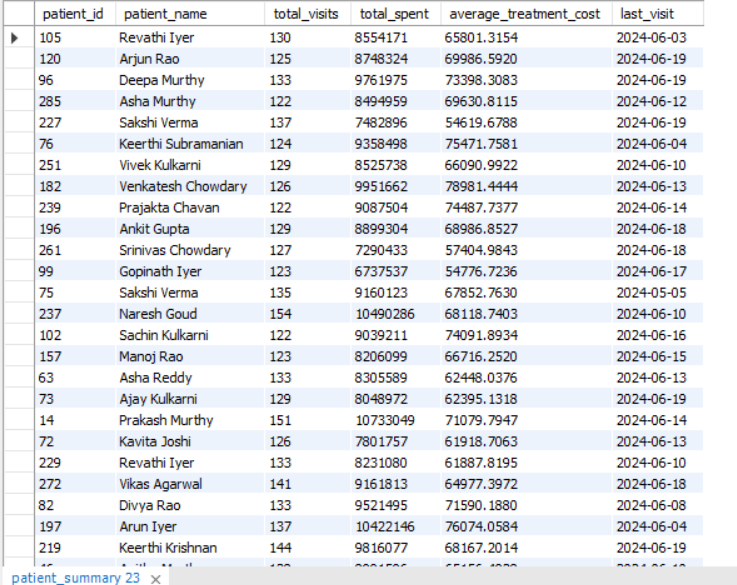
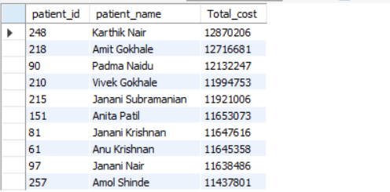
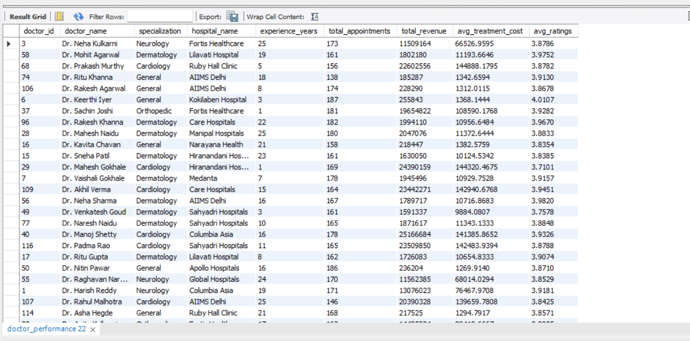
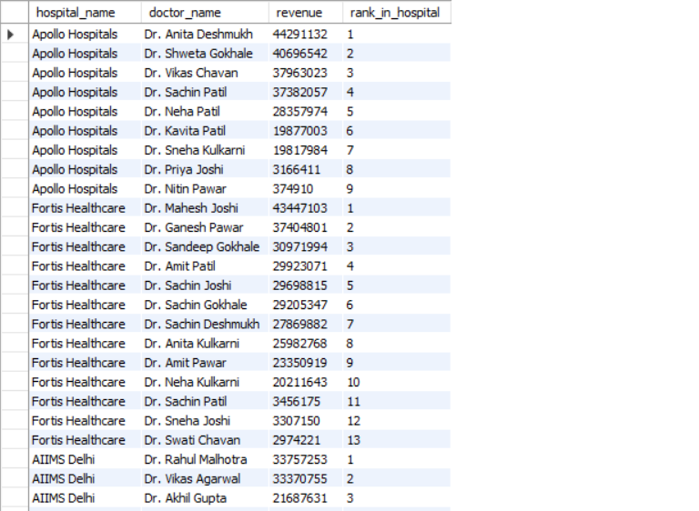
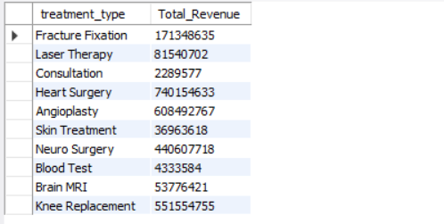

# 🏥 Healthcare Data Analysis (SQL Project)

## 📌 Objective

Analyze healthcare data to identify revenue drivers, high-value patients, and doctor performance for better business decision-making.

---

## 🛠 Tools Used

- SQL (MySQL)
- Joins (INNER, LEFT)
- Aggregations (GROUP BY, SUM)
- Window Functions (RANK, NTILE)

---

## 📂 Dataset Overview

The dataset includes structured healthcare data containing:

- Patient demographics and IDs  
- Doctor details and specialization  
- Treatment types and costs  
- Billing and revenue-related information  

---

## 🔍 Key Business Questions

- Which treatments contribute the most to overall revenue?  
- Who are the top revenue-generating doctors?  
- Which patients contribute the highest total spending?  
- How is revenue distributed across treatments and patients?  

---

## 📊 Key Insights

- Top 3 treatments contribute the majority of hospital revenue  
- A small percentage of patients account for high total spending  
- Certain doctors consistently generate higher revenue than others  
- Some treatments have high frequency but lower profitability  

---

## 📈 SQL Techniques Used

- JOINs for combining multiple tables  
- GROUP BY for aggregation and summarization  
- Window Functions (RANK, NTILE) for advanced analysis  

---

## 📊 Analysis Results

Below are key outputs from SQL analysis:

### 👤 Patients summary

### High value patients

### 💰 Doctors Performance

### 👤 Hospitalwise doctor ranking

## 💰 revenue by treatments

---

## 🧹 Data Cleaning

- Checked for missing values  
- Ensured correct data types  
- Removed duplicate records  
- Standardized column formats  
---

## 🔍 Sample SQL Query

SELECT doctor_id,
       SUM(cost) AS revenue,
       RANK() OVER (ORDER BY SUM(cost) DESC) AS rank
FROM treatments
GROUP BY doctor_id;
---

---

## 🚀 11. Outcome

### ❌ Current:
Basic

### ✅ Improve to:

## 🚀 Outcome

This analysis helps in:

- Identifying high-revenue treatments  
- Targeting high-value patients  
- Evaluating doctor performance  
- Supporting data-driven hospital decisions

  ---

  ## ⚠️ Limitations

- Dataset may not represent real-world hospital data  
- Limited dataset size  
- Assumptions made during analysis

---

## 🔗 Author

Avinash Chavan
